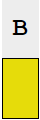

# Code Haven

Welcome to Code Haven, a tool to practice K1, K2, K3, and random substitution Aristocrats, Patristocrats, and Xenocrypts
for the Codebusters Science Olympiad event. The aim of this tool is to mimic a problem on a real Codebusters test as
closely as possible (while still being convenient to use).

> **Note:** Xenocrypts are English quotes translated into Spanish and may not always be accurate. Keyword alphabets will
> always encode with an English keyword

> **Note:** Not compatible with mobile; requires a physical keyboard

## Entering Text

To start solving a problem, select a letter by clicking the box under the ciphertext letter. Use the keyboard to type a
letter, which will be entered for all instances of the selected letter. The selected element will then advance to the
next empty letter.
> ***Note:** to type Ñ for Xenocrypts, press the `~` (tilde) key*

| Color                                               | Meaning                                                                         |
|-----------------------------------------------------|---------------------------------------------------------------------------------|
|     | Currently selected element                                                      |
|      | Same letter as the selected letter,  but not the currently selected element |
|  | Unselected letter                                                               |

## Completing a Problem

Once a problem has been completed, press the `[Enter]` or `[Return]` key. If the entered solution is correct, an alert
will appear with the solution and the time taken to solve the problem.

## Tools

There are five tools available in CodeHaven to make solving ciphers easier

### Pattern Marking

Clicking the ciphertext letters (in gray) on any cipher will mark this letter in blue to more easily recognize repeating
patterns, especially helpful for Patristocrats

### Word Breaks

Only for Patristocrats, clicking in between two letters will create a separation between these letters, signifying a
break between words for increased readability

### Autocheck

When autocheck is enabled by clicking the checkbox at the top, incorrect letters will be highlighted in red in both the
cipher and the frequency table at the bottom

### Hint

When the hint button is pressed, one correct letter will be inputted into the cipher, starting with vowels and followed
by consonants in order of frequency in the English or Spanish language

### Reset

When the reset button is pressed, the entire text of the cipher is removed, but marked patterns will remain

